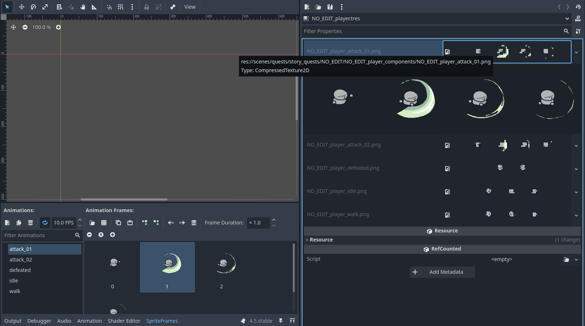

# SpriteFrames exported textures

An addon that exposes the texture resources that are internally used by SpriteFrames resources, allowing replacing them by other textures.

The main use case for this addon is editing a SpriteFrames by swapping the spritesheets it uses.

--------------

Replacing a texture by another updates all animations that were using frames created from that texture:

Only allows replacing textures by other textures of the same exact size:

